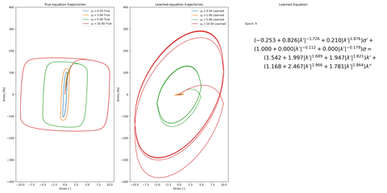

# Mechanistic PDE Networks for Discovery of Governing Equations

*Mechanistic PDE Networks for Discovery of Governing Equations*, Adeel Pervez, Efstratios Gavves, Francesco Locatello, *International Conference on Machine Learning (ICML) 2025*. \[[Arxiv](http://arxiv.org/abs/2502.18377)\]


## Running Experiments

### Requirements
- Pytorch
- Cupy
- Matplotlib
- Numpy and Scipy

### Examples

The `examples` directory contains Jupyter notebook examples for using the dense direct and sparse multigrid preconditioned solvers for simple PDEs. Also included is an example to fit a PDE to data.  Make sure the top-level directories are in the path before running the notebooks.

### Data

Data for the Burgers and Ginzburg Landau reaction diffusion equations are include in the `data` directory. The reactoin diffusion dataset was generated using the example script at [http://basilisk.fr/src/examples/ginzburg-landau.c](http://basilisk.fr/src/examples/ginzburg-landau.c). The full data is large so a small subset of the data is included in the directory.

### PDE Discovery

**1D Burgers Equation**. For the viscous 1D Burgers equation PDE discovery run

```
PYTHONPATH=. python discovery/burgers_dparam_viscous.py
```

**Ginzburg Landau Reaction Diffusion**. 


For the reaction-diffusion equation run
```
PYTHONPATH=. python discovery/ginzburg_landau.py
```

It can be necessary to tune the balanace between accuracy and compute time for the multigrid solver. The parameters can be tuned in `config.py`.

Logs are saved in the `logs` directory. 

### ODE Discovery 
The PDE code can also be used for ODE discovery. The repository includes code for learning the Kamani equation from Rheology.
```
PYTHONPATH=. python discovery/kamani.py
```

The following animations simulate the learning of the Kamani equations when the coefficients are fixed and varying. With fixed expoenents the exact coefficients are learned. When the exponents are also learned some coefficients are different from the ones used to generate the data.




## Citation
```
@inproceedings{pervezmechnnpde2025,
  title={Mechanistic PDE Networks for Discovery of Governing Equations},
  author={Pervez, Adeel and Gavves, Efstratios and Locatello, Francesco},
  booktitle={Forty-second International Conference on Machine Learning},
  year={2025}
}
```